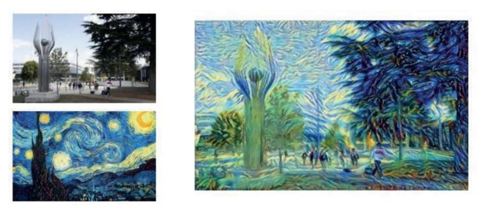

## Projet transfert de style

This project was carried out within Automatants, CentraleSupélec's AI association, under the supervision of Thibault Nadin, a member of the association in 2023, during my first year in the engineering cycle.
It consists in setting up a neural style transfer tool using the VGG19 model.

Here is an example of a possible application of this tool : 
